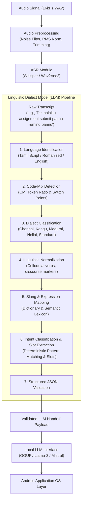

# AVA LDM Architecture Specification

This document details the system architecture of the **Accentric Virtual Assistant (AVA) Linguistic Dialect Model (LDM) Studio**. AVA is an on-device virtual assistant architecture specialized for regional Tamil dialects and Tanglish (Tamil-English code-mixed speech).

---

## 1. Architectural Philosophy & Boundaries

The core architectural principle of AVA is strict separation of concerns across a sequential pipeline:

```
[ Audio Input ]
       │
       ▼
┌──────────────┐
│  ASR Engine  │  (Whisper / Wav2Vec2)
└──────┬───────┘
       │  Raw Speech Transcript (Tamil / Tanglish / Romanized)
       ▼
┌──────────────┐
│   AVA LDM    │  (Linguistic Dialect Model)
│   Pipeline   │  Language ID → Dialect ID → Code-Mix → Normalization → Intent/Entities
└──────┬───────┘
       │  Normalized Structured Output (Standard English Semantics + Intent + Slots)
       ▼
┌──────────────┐
│  Local LLM   │  (Quantized GGUF / Llama.cpp / Transformers)
└──────┬───────┘
       │  Synthesized Response / Executable Action Plan
       ▼
[ Android OS / Execution Layer ]
```

### Strict System Boundaries:
1. **The LDM is NOT an execution layer**: The LDM does **not** launch Android applications, adjust hardware toggles, send messages, or manipulate system services.
2. **The LDM is NOT a conversational chatbot**: The LDM does **not** hallucinate responses or chat with the user. Its sole purpose is **linguistic disambiguation, dialect identification, morphological normalization, and semantic intent/slot extraction**.
3. **Local-First & Zero-Cloud**: All processing operates strictly on-device or on a private local server without external API calls or third-party cloud data transmission.

---

## 2. End-to-End Pipeline Data Flow



---

## 3. Subsystem Breakdown

### 3.1 Automatic Speech Recognition (ASR)
- **Primary Model**: OpenAI Whisper (quantized / small / base) and Wav2Vec2-XLSR-Tamil.
- **Audio Requirements**: 16,000 Hz sample rate, single-channel mono PCM, 16-bit depth.
- **Responsibilities**: Transcribing incoming acoustic waveforms into orthographic text.
- **Output**: Raw string transcript with token-level confidence scores.

### 3.2 Linguistic Dialect Model (LDM)
The core component of this research repository, encapsulated in `src/ldm/pipeline.py` (Python) and `RuleBasedLdmProcessor.kt` (Android Kotlin).
- **Language & Code-Mix Detector** (`src/data/cmi.py`, `src/linguistic/code_mix.py`):
  - Calculates Code-Mixing Index (CMI) proxy based on token distribution across Tamil, English, and Romanized markers.
- **Dialect Classifier** (`src/dialect/`):
  - Acoustic branch: Fine-tuned `facebook/wav2vec2-xls-r-300m` evaluating phonetic variance.
  - Lexical branch: Regional marker dictionaries for Chennai (*machi, dei, bruh*), Madurai (*thambi, aama*), Kongu (*ayya, yov, la*), Nellai (*pa, ppa, phone pottu kudu*).
- **Linguistic Normalizer** (`src/linguistic/normalizer.py`):
  - Strips discourse fillers (*da, la, pa, bruh*).
  - Normalizes colloquial verb inflections (e.g., *pannu/pannunga* → *do/execute*, *anuppu* → *send*, *vai* → *set*).
  - Maps regional vocabulary to canonical English actions.
- **Intent & Slot Extractor** (`src/intent/classifier.py`, `src/intent/extractor.py`):
  - Categorizes requests into 10 target intents (`CREATE_REMINDER`, `SET_ALARM`, `MAKE_CALL`, `SEND_MESSAGE`, `OPEN_APP`, `NAVIGATE`, `CHECK_WEATHER`, `DEVICE_SETTING`, `SEARCH_INFO`, `SMALL_TALK`).
  - Extracts typed slots (`target`, `time`, `action`, `app_name`, `location`, `value`).

### 3.3 Local Large Language Model (LLM) Interface
Located in `src/llm/`, this module provides an adapter layer decouple from the LDM:
- **`BaseLLMEngine`**: Unified abstract interface with streaming and batch generation.
- **Supported Backends**:
  - `LlamaCppEngine`: High-performance quantized GGUF models on CPU/CUDA.
  - `HuggingFaceEngine`: PyTorch/Transformers models.
  - `MockLLMEngine`: Deterministic responses for testing and continuous integration.
- **Prompt Builder** (`src/llm/prompt_builder.py`): Formats the normalized structured LDM payload into concise system prompts for the LLM.

---

## 4. Module Interfaces & Schemas

### LDM Input:
- Raw audio path (`.wav`) or pre-transcribed text string.
- Optional `UserProfile` for personalization context.

### LDM Output Schema:
```json
{
  "transcript": "Dei nalaiku assignment submit panna remind pannu",
  "language": "Tanglish",
  "code_mixed": true,
  "dialect": "Chennai",
  "normalized_text": "Remind me to submit my assignment tomorrow.",
  "intent": "CREATE_REMINDER",
  "entities": {
    "action": "submit assignment",
    "time": "tomorrow"
  },
  "confidence": {
    "language": 0.95,
    "dialect": 0.85,
    "intent": 0.90,
    "overall": 0.90
  },
  "latency_ms": {
    "asr": 12.5,
    "ldm": 0.25,
    "total": 12.75
  }
}
```

---

## 5. Dual Implementation: Research Python vs Native Android Kotlin

To validate both deep machine learning research and on-device deployment viability, the repository provides dual implementations of identical interface contracts:

| Dimension | Python Research Pipeline (`src/`) | Android Native Prototype (`android/`) |
| :--- | :--- | :--- |
| **Primary Use** | Training, Acoustic Benchmarking, Evaluation | On-device Edge Prototyping, Live UI Demonstration |
| **Execution Framework** | PyTorch, Torchaudio, Transformers, FastAPI | Kotlin 2.0, Jetpack Compose, Android SDK 35 |
| **Dialect Engine** | Wav2Vec2 Acoustic Model + Lexical Normalizer | Pure Kotlin Rule-Based Normalizer (`RuleBasedLdmProcessor`) |
| **Latency Profile** | 12–25 ms (CPU/GPU) | < 1.0 ms (pure memory operations) |
| **Dependencies** | Python 3.10+, PyTorch, Hugging Face | AndroidX, Material3, OpenJDK 21 |
