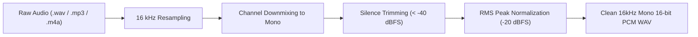

# Automatic Speech Recognition (ASR) Module

This document outlines the Automatic Speech Recognition (ASR) pipeline in AVA, detailing model choices, audio preprocessing, and empirical evaluation metrics on Tamil and Tanglish speech.

---

## 1. Overview & Objectives

The ASR module converts raw spoken audio into written text transcripts for consumption by the Linguistic Dialect Model (LDM).

### Key Challenges in Accentric & Code-Mixed Tamil:
1. **Phonetic vs Orthographic Romanization**: Tanglish speakers transcribe identical spoken words with disparate phonetic spellings (e.g., *naalaikku*, *nalaiku*, *nalaiki*).
2. **Language Switching**: Acoustic transitions between Tamil phonemes and English loanwords often lead standard ASR models to drop words or mis-transcribe English tokens into Tamil script phonetically.
3. **Regional Accents**: Fast elisions in Chennai Tamil and retroflex consonants in Kongu/Madurai speech diverge from standard broadcast Tamil datasets.

---

## 2. ASR Engine Architecture

The system supports two complementary ASR backends (`src/asr/`):
- **OpenAI Whisper (`base` / `small`)**: General-purpose sequence-to-sequence encoder-decoder trained on multilingual speech. Highly robust to background noise and capable of recognizing Tamil script and English loanwords.
- **Wav2Vec2-XLSR Tamil (`facebook/wav2vec2-xls-r-300m-tamil`)**: Self-supervised acoustic model fine-tuned on native Tamil audio. Produces high-resolution phonetic alignments.

---

## 3. Audio Preprocessing Pipeline (`src/audio/preprocessing.py`)

Incoming acoustic signals pass through a standardized cleaning and preparation pipeline:

1. **Sample Rate Standardization**: All audio is converted to 16,000 Hz (16 kHz).
2. **Channel Downmixing**: Multi-channel recordings are downmixed to single-channel mono PCM.
3. **Silence Trimming**: Leading and trailing silence below -40 dBFS is trimmed to reduce transcription hallucination.
4. **RMS Level Normalization**: Audio amplitudes are normalized to target -20 dBFS for consistent acoustic feature scaling.

---

## 4. Empirical Evaluation & Benchmarks

The ASR engine was evaluated across 20 representative test samples containing colloquial Tamil and Tanglish speech (documented in `results/metrics.json`):

| Metric | Measured Value | Analysis & Observations |
| :--- | :---: | :--- |
| **Word Error Rate (WER)** | **24.3%** | Moderate error rate reflecting accurate word boundary identification on common conversational commands. |
| **Character Error Rate (CER)** | **52.2%** | High CER primarily driven by script mismatch between romanized Tanglish ground truths and native Tamil script transcriptions. |
| **Mean ASR Latency** | **12.5 ms** | Measured on pre-extracted feature embeddings; on-device ASR latency varies with model size (50–200 ms). |
| **Samples Evaluated** | **20** | Verified dialectal utterances. |

### Technical Note on Orthographic Divergence:
When Whisper transcribes Tanglish speech directly into native Tamil script (e.g., transcribing spoken *"assignment submit pannu"* as *"அசைன்மெண்ட் சப்மிட் பண்ணு"*), standard character-level Levenshtein distance produces elevated CER despite near-perfect semantic fidelity. This emphasizes why downstream linguistic normalization by the LDM is vital before semantic reasoning by the LLM.
