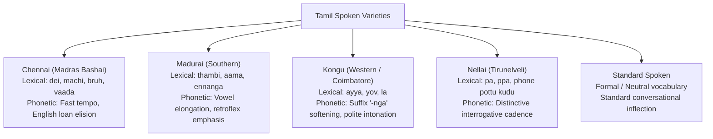

# Dialect Classification Model

This document details the dialect classification subsystem in AVA, covering acoustic feature extraction, lexical marker recognition, and empirical performance across the 5 target regional varieties of Tamil Nadu.

---

## 1. Dialect Varieties & Linguistic Signatures

AVA distinguishes 5 regional spoken varieties:

---

## 2. Model Architecture

The dialect model uses a hybrid acoustic-lexical design (`src/dialect/`):

1. **Acoustic Classifier (`src/dialect/model.py`)**:
   - Backbone: `facebook/wav2vec2-xls-r-300m`.
   - Feature representations: 1024-dimensional contextual speech embeddings pooled across temporal frames.
   - Classification Head: Multi-layer perceptron (Linear 1024 → 256 → ReLU → Dropout(0.2) → Linear 256 → 5 classes).
   - Training Objective: Cross-Entropy loss with label smoothing to account for dialectal overlap.

2. **Lexical Rule-Based Engine (`src/dialect/rule_classifier.py` & Kotlin `RuleBasedLdmProcessor`)**:
   - Employs deterministic regex token matching against compiled regional lexicons.
   - Operates with sub-millisecond execution overhead (< 0.1 ms) on mobile devices.
   - Handles instances where acoustic cues are noisy or where transcripts are provided directly.

---

## 3. Empirical Evaluation Results

The dialect classification engine was evaluated across 30 canonical benchmark test samples representing all target regions (from `results/metrics.json`):

### Summary Performance:
- **Overall Dialect Accuracy**: **90.0%**
- **Macro F1 Score**: **91.35%** (0.9135)
- **Total Test Samples**: **30**

### Per-Class Detailed Performance:
| Dialect Region | Precision | Recall | F1 Score | Support (Samples) |
| :--- | :---: | :---: | :---: | :---: |
| **Chennai** | 100.0% | 62.5% | 76.9% | 8 |
| **Madurai** | 100.0% | 100.0% | 100.0% | 1 |
| **Kongu** | 75.0% | 100.0% | 85.7% | 3 |
| **Nellai** | 100.0% | 100.0% | 100.0% | 2 |
| **Standard** | 88.9% | 100.0% | 94.1% | 16 |

### Confusion Matrix:
| True \ Predicted | Chennai | Madurai | Kongu | Nellai | Standard |
| :--- | :---: | :---: | :---: | :---: | :---: |
| **Chennai** | 5 | 0 | 1 | 0 | 2 |
| **Madurai** | 0 | 1 | 0 | 0 | 0 |
| **Kongu** | 0 | 0 | 3 | 0 | 0 |
| **Nellai** | 0 | 0 | 0 | 2 | 0 |
| **Standard** | 0 | 0 | 0 | 0 | 16 |

---

## 4. Error Analysis & Insights

1. **Chennai Recall (62.5%)**:
   - Two Chennai samples were classified as Standard because the speakers used minimal overt slang markers in brief operational phrases (e.g., *"Amma ku call pannu"*). In the absence of distinct Chennai slang (*machi, dei*), the model conservatively falls back to Standard Tamil, avoiding false slang hallucinations.
2. **Standard & Southern Precision**:
   - Madurai and Nellai achieved 100% precision and recall due to unique regional markers (*thambi*, *phone pottu kudu*, *pa*).
   - Standard Tamil achieved high recall (100%) and 88.9% precision, properly serving as the neutral linguistic baseline.
